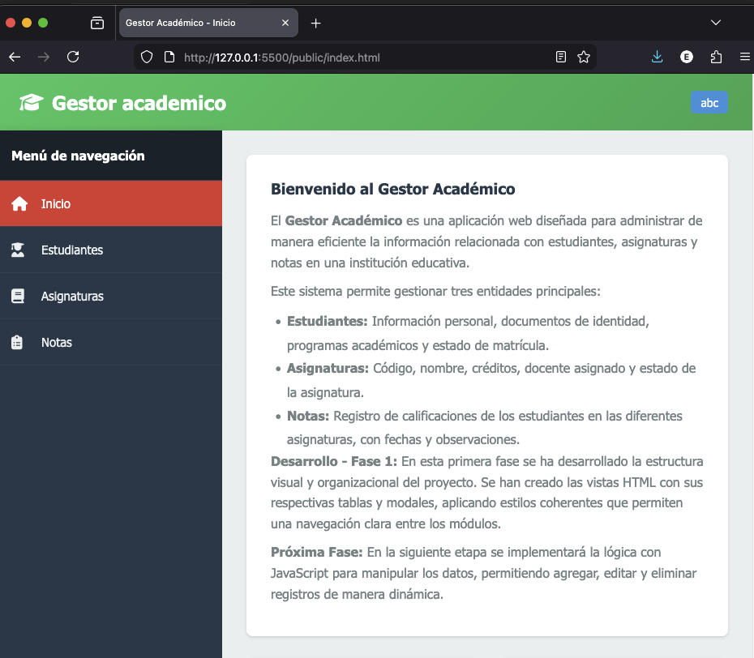
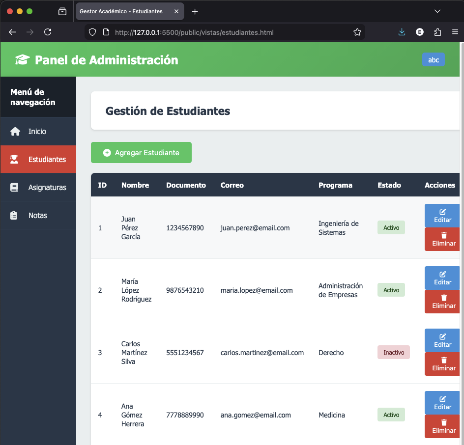
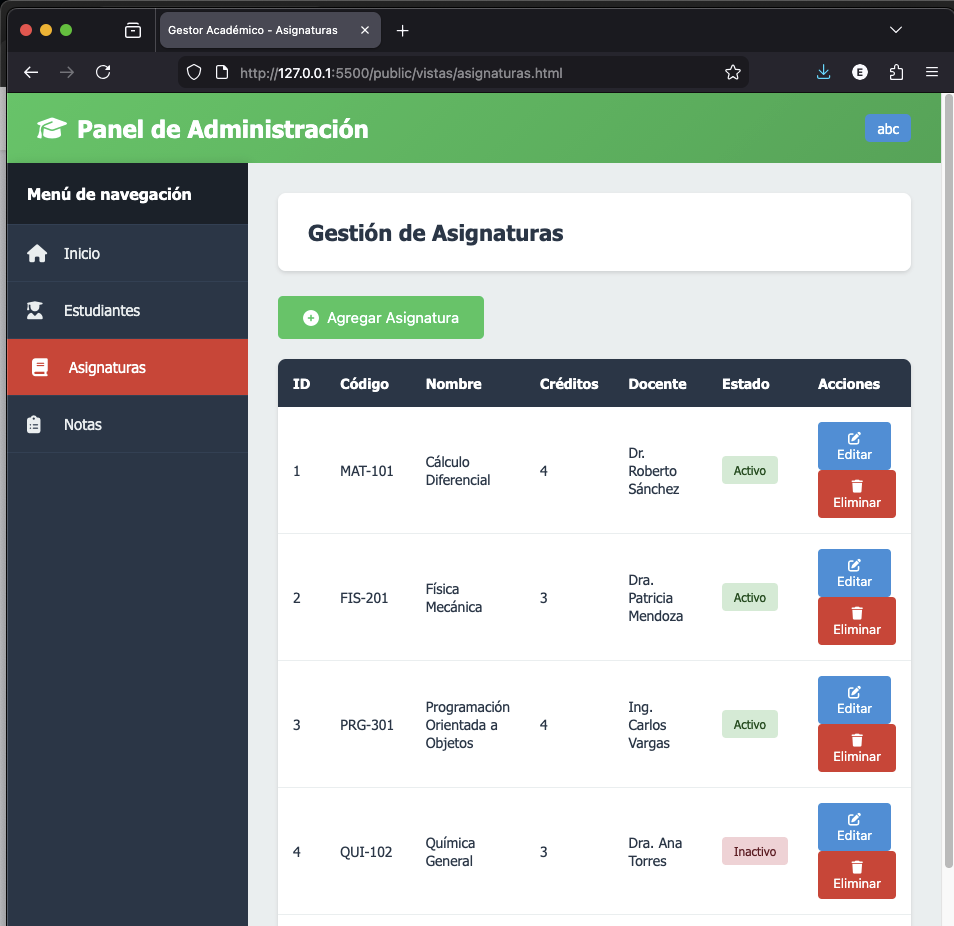
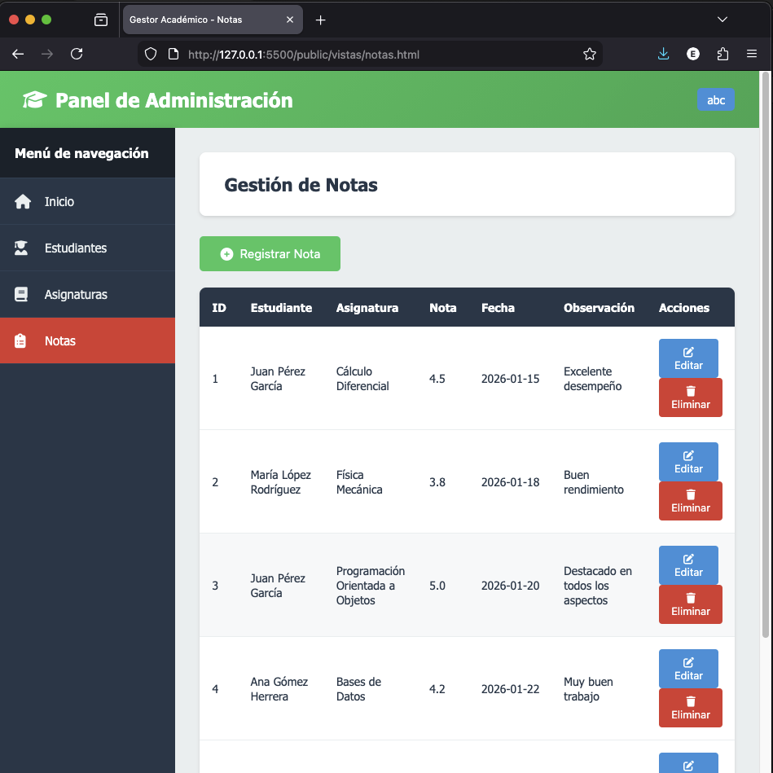
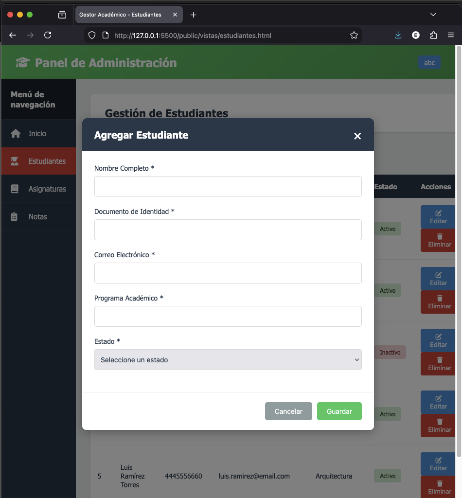

# Gestor Académico

## Descripción del Proyecto

El **Gestor Académico** es una aplicación web diseñada para administrar de manera eficiente la información relacionada con estudiantes, asignaturas y notas en una institución educativa.

Este sistema permite gestionar tres entidades principales:
- **Estudiantes**: Información personal, documentos de identidad, programas académicos y estado de matrícula.
- **Asignaturas**: Código, nombre, créditos, docente asignado y estado de la asignatura.
- **Notas**: Registro de calificaciones de los estudiantes en las diferentes asignaturas, con fechas y observaciones.

## Desarrollo por Fases

### Fase 1 
En esta primera fase se ha desarrollado la estructura visual y organizacional del proyecto. Se han creado las vistas HTML con sus respectivas tablas y modales, aplicando estilos coherentes que permiten una navegación clara entre los módulos.

**Características implementadas:**
- Estructura completa del proyecto en HTML y CSS
- Diseño responsivo con sidebar de navegación
- Cuatro vistas principales: Inicio, Estudiantes, Asignaturas y Notas
- Tablas estructuradas para visualización de datos
- Modales para agregar y editar registros
- Diseño visual coherente y profesional

### Fase 2 
En la siguiente etapa se implementará la lógica con JavaScript para manipular los datos, permitiendo agregar, editar y eliminar registros de manera dinámica.

## Estructura de Carpetas

```
gestor-academico/
├── public/
│   ├── index.html
│   ├── vistas/
│   │   ├── estudiantes.html
│   │   ├── asignaturas.html
│   │   └── notas.html
│   └── assets/
│       └── img/
│           └── capturas/
│               ├── index.png
│               ├── estudiantes.png
│               ├── asignaturas.png
│               ├──── notas.png
                └── Vista modal.png
├── src/
│   └── css/
│       └── style.css
└── README.md
```

## Instrucciones para Ejecutar el Proyecto

1. **Clonar o descargar el repositorio**
   ```bash
   git clone https://github.com/EdwinGoMe/gestor_academico.git
   cd gestor-academico
   ```

2. **Abrir el proyecto**
   - Navegar hasta la carpeta `public`
   - Abrir el archivo `index.html` en el navegador
   - También puedes usar un servidor local como Live Server 

3. **Navegación**
   - Utiliza el menú lateral (sidebar) para navegar entre las diferentes secciones
   - Haz clic en los botones "Agregar" para ver los modales de formularios
   - Los botones de "Editar" y "Eliminar" aún no tienen funcionalidad (Fase 2)

## Tecnologías Utilizadas

- **HTML5**: Estructura semántica de las páginas
- **CSS3**: Estilos personalizados y diseño responsivo
- **Font Awesome 6.4.0**: Iconos para mejorar la interfaz de usuario

## Capturas de Pantalla

### Página Principal


### Gestión de Estudiantes


### Gestión de Asignaturas


### Gestión de Notas


### Vista modal



## Autor

Edwin Gomez 

## Año

© 2026 - Todos los derechos reservados
