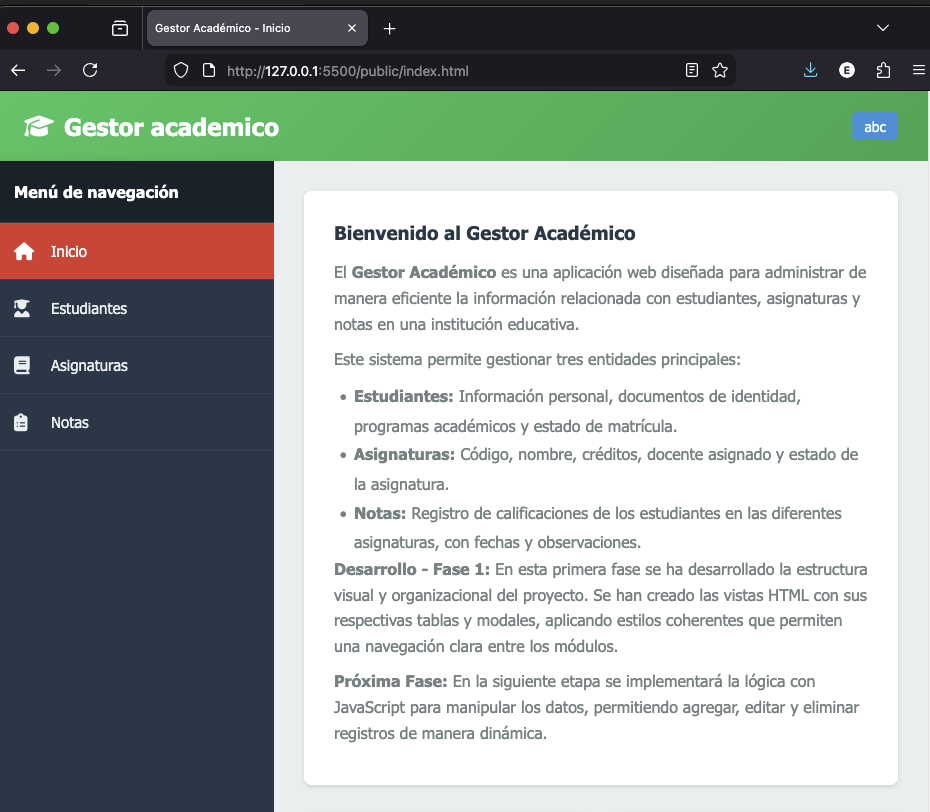
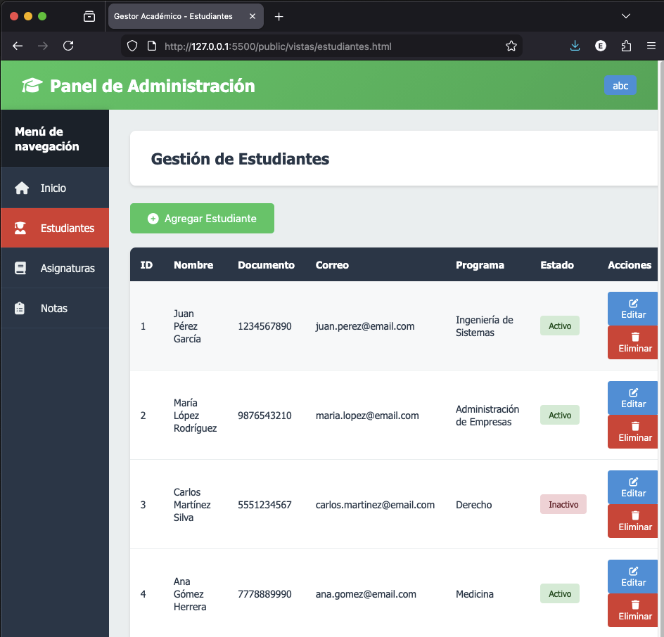
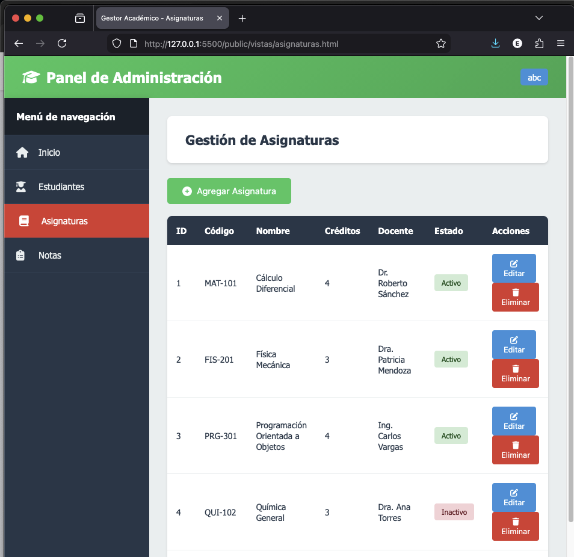
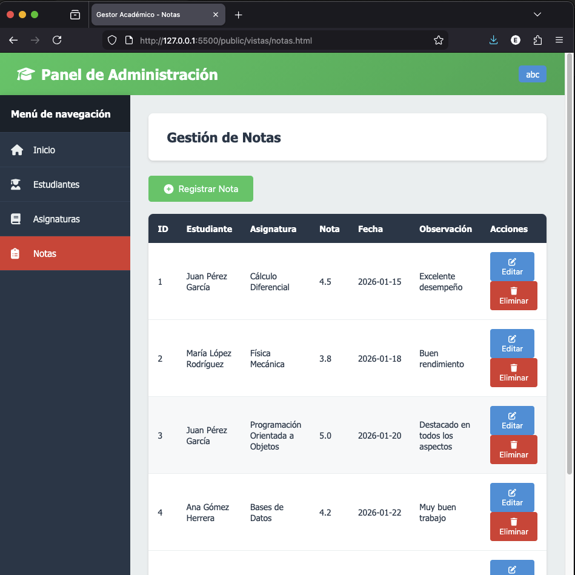

# Gestor Académico

## Descripción del Proyecto

El **Gestor Académico** es una aplicación web diseñada para administrar de manera eficiente la información relacionada con estudiantes, asignaturas y notas en una institución educativa.

Este sistema permite gestionar tres entidades principales:
- **Estudiantes**: Información personal, documentos de identidad, programas académicos y estado de matrícula.
- **Asignaturas**: Código, nombre, créditos, docente asignado y estado de la asignatura.
- **Notas**: Registro de calificaciones de los estudiantes en las diferentes asignaturas, con fechas y observaciones.

## Desarrollo por Fases

### Fase 1 
En esta primera fase se ha desarrollado la estructura visual y organizacional del proyecto. Se han creado las vistas HTML con sus respectivas tablas y modales, aplicando estilos coherentes que permiten una navegación clara entre los módulos.

### Fase 2 
Se incorporó JavaScript para convertir la maqueta visual en un sistema funcional en el navegador. Se implementaron las siguientes características:
- **CRUD en Memoria**: Permite agregar, editar y eliminar registros dinámicamente en los módulos de Estudiantes, Asignaturas y Notas.
- **Interacción por Modales**: Todas las operaciones de creación y edición se realizan exclusivamente a través de ventanas modales.
- **Overlay de Carga**: Se incluyó un sistema de "Loading..." simulado con mensajes personalizados para cada acción, mejorando la experiencia de usuario.
- **Delegación de Eventos**: Se optimizó el rendimiento mediante el uso de delegación de eventos en las tablas.
- **Refuerzo de Flujo de Guardado**: Uso de un único evento `submit` para gestionar tanto la creación como la actualización de datos.

## Estructura de Carpetas

```
gestor-academico/
├── public/
│   ├── index.html
│   ├── vistas/
│   │   ├── estudiantes.html
│   │   ├── asignaturas.html
│   │   └── notas.html
│   └── assets/
│       └── img/
│           └── capturas/
│               ├── index.png
│               ├── estudiantes.png
│               ├── asignaturas.png
│               ├── notas.png
│               └── modal.png
├── src/
│   ├── css/
│   │   └── style.css
│   └── js/
│       ├── estudiantes.js
│       ├── asignaturas.js
│       └── notas.js
└── README.md
```

## Instrucciones para Ejecutar el Proyecto

1. **Clonar o descargar el repositorio**
   ```bash
   git clone https://github.com/EdwinGoMe/gestor_academico.git
   cd gestor-academico
   ```

2. **Abrir el proyecto**
   - Navegar hasta la carpeta `public`
   - Abrir el archivo `index.html` en el navegador
   - También puedes usar un servidor local como Live Server 

3. **Funcionalidad**
   - Los datos iniciales se cargan automáticamente al entrar a cada módulo.
   - Las operaciones CRUD (Crear, Leer, Actualizar, Eliminar) son funcionales y se guardan en memoria (volátiles al recargar la página).

## Tecnologías Utilizadas

- **HTML5**: Estructura semántica de las páginas.
- **CSS3**: Estilos personalizados, diseño responsivo y animaciones de carga.
- **JavaScript (ES6+)**: Lógica funcional, manipulación del DOM y gestión de datos.
- **Font Awesome 6.4.0**: Iconos para mejorar la interfaz de usuario.

## Capturas de Pantalla (Actualizadas Fase 2)
*(Las capturas muestran el sistema con datos dinámicos y el overlay de carga)*

### Página Principal


### Gestión de Estudiantes (Datos Dinámicos)


### Gestión de Asignaturas (Datos Dinámicos)


### Gestión de Notas (Datos Dinámicos)


### Overlay de Carga en Acción


## Autor

Edwin Gomez 

## Año

© 2026 - Todos los derechos reservados
